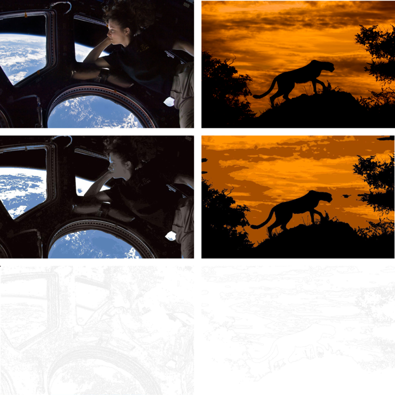

# MalenNachZahlen
Diese Anwendung verwandelt Bilder in Zeichnungen, die man ausdrucken und selber bemalen kann./ This is an application, which can turn an image into a draft, so that it can be printed out and painted.

Benutzung/ Usage:
java -jar MnZ.jar /path/to/file numberOfColors

Beispiel/ Example:
java -jar MnZ.jar ~/Desktop/Cheetah_at_Sunset.jpg 5

Tasten/ Keys
b : Generiere Rahmen/ generate borders

s : Bild speichern/ save image

